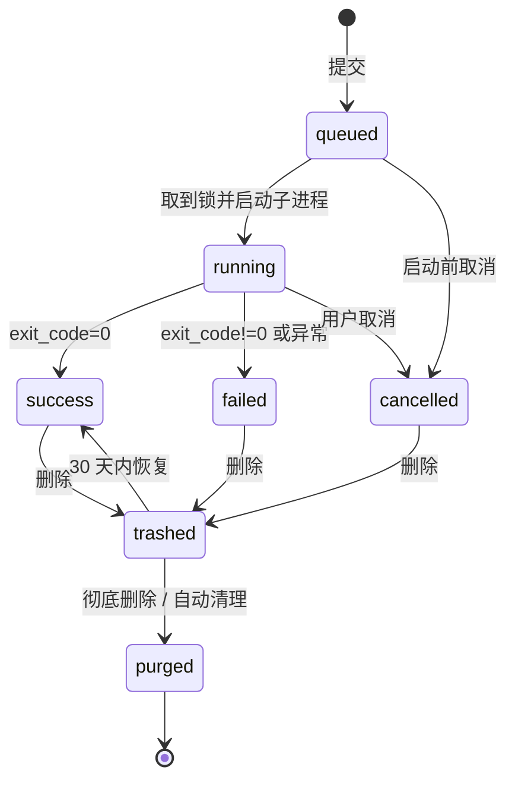
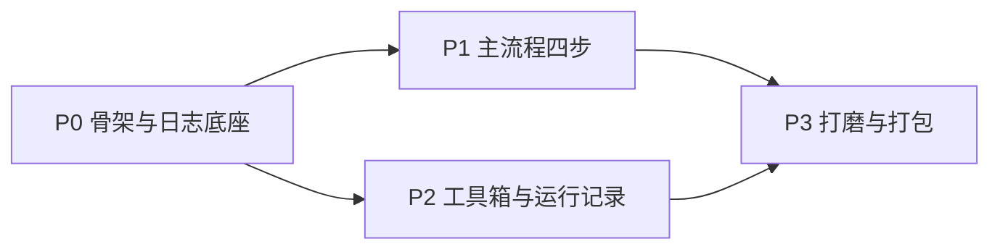

# 北京大事件整理系统 · Web 前端开发指南

> 本文档是**开发执行手册**：按什么顺序写、每一步交付什么、验收标准是什么。
>
> 与另两份文档的分工：
>
> | 文档 | 管什么 | 读者 |
> |---|---|---|
> | 《Web前端设计需求.md》 | 长什么样（信息架构、线框、视觉调性） | 设计模型 / 设计师 |
> | 《Web化评估与计划.md》 | 怎么部署（Windows 离线包、端口、后端选型、数据写回策略） | 部署实施 |
> | **《Web前端开发指南.md》（本文）** | **按什么顺序写、接口契约、运行记录子系统、每步验收** | 前端 / 全栈实施 |
>
> 三份有冲突时：部署相关以《Web化评估与计划.md》为准，视觉相关以《Web前端设计需求.md》为准，实现顺序与接口契约以本文为准。
>
> **本文不改动任何现有 Python 脚本。** 所有脚本以子进程方式被调用，stdout 捕获为日志。

---

## 1. 技术栈与选型理由

| 层 | 选择 | 理由 |
|---|---|---|
| 构建 | **Vite + React 18 + TypeScript** | 产出纯静态 `dist/`，由 FastAPI `StaticFiles` 托管 |
| UI 库 | **Ant Design 5** | Table / Form / Upload / Steps / Result / Descriptions 全内置，原生 `zhCN` locale，密集数据后台是它的主场 |
| 服务端状态 | **TanStack Query** | 任务状态轮询、canonical 变更后的缓存失效 |
| 客户端状态 | **Zustand**（一个 store） | 全局编辑锁 + 当前运行任务，供顶部状态条和所有按钮的 disabled 消费 |
| 实时日志 | **原生 `EventSource`** 包一层 `useJobLog` | SSE，不引 socket.io |
| 日志渲染 | **`rc-virtual-list`**（AntD 自带依赖） | 演唱会采集单次上万行，朴素 DOM append 必卡 |
| 路由 | **React Router 6**，history 模式 + 后端 SPA fallback | |
| 表单 | **AntD Form + 后端下发的 param schema** | 见 §2，前端不重复定义参数 |
| 字体 | 系统中文无衬线 + **本地打包** JetBrains Mono woff2 子集 | |
| 图表 | **v1 不引** | 唯一需要的分类分布用 CSS 条形列表即可 |
| 测试 | Vitest 只覆盖 schema 渲染器与差异摘要逻辑 | 不追覆盖率 |

### 1.1 两条硬性排除（部署约束倒推）

- **不用 Next.js / Nuxt / Remix**：目标服务器是免管理员的便携安装包，**没有 Node 运行时**。任何需要 Node 常驻的框架直接出局。SSR 没有收益，这是内网登录后台。
- **不引任何 CDN 资源**：服务器**无外网**。字体、图标、polyfill 全部本地打包。P3 有一条强制验收：构建产物内 `grep` 不到任何 `http://` / `https://` 外部资源引用。

### 1.2 与后端的边界

前端只认 REST + SSE，不碰文件系统、不拼命令行。**参数校验、命令拼装、危险性判定全在后端**。前端拿到的是 schema 和结果，这样新增脚本或改 flag 时前端零改动。

---

## 2. 核心架构：job registry 驱动

### 2.1 为什么不是「一个脚本一个页面」

现在的 SOP 实际有 **18 个可运行操作**（不是 2 个）。若为每个场景做专属页面，页面会膨胀且仍会漏掉维护类操作（`enrich` / `dedup` / `verify` / `add_dates_column` 这些在《Web前端设计需求.md》里完全没提）。

所以：**后端声明一次，前端三个通用组件消费**。新增脚本或给 `main.py` 加一个 flag，只需加/改一条 registry 记录，前端不动。参数只存在于后端一处，永远不会和真实 CLI 签名漂移——这是这类内部工具最典型的腐化点。

### 2.2 操作清单（registry 全量）

| id | 分组 | 中文名 | 实际命令 | 危险级 | 占锁 |
|---|---|---|---|---|---|
| `step1_full` | 抽取 | 全量抽取（文件+演唱会） | `01_event_extractor/main.py --concert` | 写 canonical | 是 |
| `step1_input_only` | 抽取 | 只处理上传文件 | `main.py --only-input` | 写 canonical | 是 |
| `step1_concert_only` | 抽取 | 只采集演唱会 | `main.py --only-concert` | 写 canonical | 是 |
| `dates_enrich_dry` | canonical 维护 | Dates 列自动抽取（试运行） | `enrich_concert_dates.py --dry-run` | 无 | 否 |
| `dates_enrich_write` | canonical 维护 | Dates 列自动抽取（写入） | `enrich_concert_dates.py` | 写 canonical | 是 |
| `dates_add_row` | canonical 维护 | 手动补单行 Dates | `add_dates_column.py --row --value` | 写 canonical | 是 |
| `canonical_dedup_dry` | canonical 维护 | 去重（试运行） | `dedup_canonical_excel.py --dry-run` | 无 | 否 |
| `canonical_dedup_write` | canonical 维护 | 去重（写入） | `dedup_canonical_excel.py [--prune-malformed]` | 破坏性 | 是 |
| `canonical_verify` | canonical 维护 | 结构守卫自检 | `verify_canonical.py` | 无 | 否 |
| `canonical_export_raw` | canonical 维护 | 用源 Excel 铺底 | `export_raw_xlsx.py` | 破坏性 | 是 |
| `calendar_extract` | 日历生成 | 抽取 High 事件 | `run_pipeline.py extract` | 无 | 是 |
| `themes_incremental` | 日历生成 | 月度主题（增量） | `run_pipeline.py themes --year` | 无 | 是 |
| `themes_force_month` | 日历生成 | 月度主题（强制单月） | `run_pipeline.py themes --month` | 无 | 是 |
| `themes_compare` | 日历生成 | 主题双模型对比 | `generate_monthly_themes.py --month --compare` | 无 | 否 |
| `calendar_check` | 日历生成 | 页面文件齐全性校验 | `run_pipeline.py calendar` | 无 | 否 |
| `calendar_package` | 日历生成 | 打包分享文件 | `run_pipeline.py package` | 无 | 是 |
| `step2_all` | 日历生成 | Step 2 一键全跑 | `run_pipeline.py all --themes --package` | 无 | 是 |
| `publish_zip` | 发布 | 生成发布 zip | 打包 `02_web_output/` | 无 | 否 |
| `publish_mark_done` | 发布 | 标记已发布 | 仅写状态，不跑脚本 | 无 | 否 |

说明：

- `main.py` 的 `--concert-force` / `--concert-start` / `--concert-end` / `--concert-venue-size` / `--mode` / `--category` / `--topic` / `--extra-info` 不是独立操作，而是上面前三条的 **params**（默认折叠在「高级选项」里）。
- `run_pipeline.py eventlist` 用本机默认程序打开 Excel，在服务器上无意义，**从 registry 移除**，由核对页的下载按钮取代。
- `add_dates_column.py --self-test` 是开发自检，不进 registry。

### 2.3 Registry 字段定义

```python
# backend/jobs/registry.py
@dataclass
class Param:
    name: str                    # 传给后端的 key
    type: str                    # bool | string | text | int | date | month | enum | files | row_ref
    label: str                   # 中文标签
    help: str = ""               # 表单下方灰色说明，直接抄脚本 argparse 的 help
    default: Any = None
    choices: list | None = None  # type=enum 时必填
    required: bool = False
    advanced: bool = False       # True 则收进「高级选项」折叠区

@dataclass
class Job:
    id: str
    group: str                   # step1 | canonical | step2 | publish
    label: str
    desc: str                    # 一句话说明「这会做什么、会改什么」
    danger: str                  # none | write_canonical | destructive
    needs_lock: bool
    dry_run_pair: str | None     # 指向对应的试运行 job id（UI 用来做「先试再写」）
    stages: list[str]            # 阶段步骤器的阶段名，按顺序
    params: list[Param]
    artifacts: list[str]         # 产物 glob，跑完登记到运行记录
    preflight: list[str]         # 前置检查 id，见 §5.4
    admin_only: bool = False     # 仅管理员可见（默认给 destructive 打开）
```

`danger` 的语义直接决定 UI 行为，不要在前端另立一套判断：

| danger | UI 行为 |
|---|---|
| `none` | 直接跑，不弹确认 |
| `write_canonical` | 跑之前提示「将修改人工审核清单，已自动备份」，一次确认 |
| `destructive` | 二次确认（需要输入确认词或勾选「我已了解」），且强制先跑 `dry_run_pair` |

`stages` 举例（用于阶段步骤器，后端按日志标记推进）：

- `step1_full`：读取文件 → LLM 抽取 → 演唱会采集 → 合并去重 → 写 Excel
- `step2_all`：抽取 High 事件 → 生成月度主题 → 校验页面 → 打包

### 2.4 前端三件套契约

```tsx
// 1) 参数表单：不写死任何字段
<JobForm
  jobId="step1_concert_only"
  onSubmitted={(runId) => nav(`/runs/${runId}`)}
/>
// 内部：GET /api/jobs/:id 拿 schema -> 按 Param.type 映射到 AntD 控件
//       advanced=true 的收进 <Collapse>
//       danger != none 时接管确认弹窗
//       needs_lock 且锁被占用时禁用提交并显示占用者

// 2) 运行监控：所有 19 个操作共用这一个组件
<JobRunner runId="20260807-2011-step1_concert_only-a3f9" />
// 内部：GET /api/runs/:id 拿元数据 + 已落盘日志（回放）
//       再开 SSE /api/runs/:id/stream 续接增量
//       渲染 StageStepper + LogPanel + SummaryCards + 结束态 CTA

// 3) 工具箱启动卡
<JobCard jobId="canonical_dedup_dry" />
```

`Param.type` 到控件的映射表（前端唯一需要维护的映射）：

| type | 控件 |
|---|---|
| `bool` | `Switch` |
| `string` | `Input` |
| `text` | `Input.TextArea` |
| `int` | `InputNumber` |
| `date` | `DatePicker`（`YYYY-MM-DD`） |
| `month` | `DatePicker picker="month"`（`YYYY-MM`） |
| `enum` | `Select`（`choices`） |
| `files` | `Upload.Dragger`（多文件） |
| `row_ref` | `InputNumber` + 旁边显示该行 Headline 供核对（防止改错行） |

### 2.5 两层 UI

| 层 | 面向 | 内容 |
|---|---|---|
| **向导层** | 非程序员，月度例行 | 4 步主流程。三个 Step 1 预设做成大卡片选择，参数全折叠。默认值必须是「直接点就对」 |
| **工具箱层** | 出问题时排查、维护 canonical | registry 全量 `JobCard`，按 group 分区，参数全暴露。取代原来的终端兜底 |

工具箱不是「开发者后门」，它是**同事在流程卡住时的自救入口**，所以每张卡片必须有 `desc`（这会做什么、会改什么）和「上次运行：3 天前 · 成功」。`admin_only` 的卡片对普通账号直接不渲染。

---

## 3. 运行记录子系统

**每一次调用都留痕，可查、可复用参数、可对比、可删除。** 这是本系统的审计底座，也是同事排查「上个月是怎么跑的」的唯一依据。

### 3.1 存储选型

**SQLite（元数据）+ 文件（日志与产物）**，不是纯 JSON。理由：

- `sqlite3` 是 Python 标准库，**不增加 `requirements.txt` 任何依赖**，对便携离线包零成本
- 历史页要按操作类型/状态/操作人/时间范围筛选和排序，纯 JSON 索引要全量读盘反序列化，几百条之后就开始卡
- 批量删除、保留策略、容量统计都是一条 SQL 的事；JSON 方案要自己实现事务，中途崩溃会留下半删状态
- 日志**不进数据库**：单次采集上万行，塞 SQLite 会让库膨胀到几百 MB 且读写互相拖累。日志走文件，DB 只存路径和字节数

数据库文件 `data/console.db`，开启 WAL 模式（`PRAGMA journal_mode=WAL`），避免写日志元数据时阻塞历史页查询。

### 3.2 表结构

```sql
CREATE TABLE runs (
  run_id                TEXT PRIMARY KEY,   -- 20260807-2011-step1_concert_only-a3f9
  op_id                 TEXT NOT NULL,      -- registry job id
  op_label              TEXT NOT NULL,      -- 冗余存中文名，registry 改名后历史不失真
  op_group              TEXT NOT NULL,
  preset                TEXT,               -- 从哪个向导预设发起（可空=工具箱直接发起）
  params_json           TEXT NOT NULL,      -- 完整参数，供「用这次参数再跑一遍」
  status                TEXT NOT NULL,      -- queued|running|success|failed|cancelled
  current_stage         TEXT,
  stage_index           INTEGER,
  started_at            TEXT NOT NULL,      -- ISO8601 本地时间
  ended_at              TEXT,
  duration_ms           INTEGER,
  exit_code             INTEGER,
  operator              TEXT NOT NULL,      -- 登录用户名
  log_path              TEXT NOT NULL,      -- data/runs/<run_id>/stdout.jsonl
  log_lines             INTEGER DEFAULT 0,
  log_bytes             INTEGER DEFAULT 0,
  summary_json          TEXT,               -- 见 3.4 解析产出
  llm_json              TEXT,               -- provider / calls / tokens
  error_summary         TEXT,               -- 一句大白话
  error_kind            TEXT,               -- 已知错误分类 key，见 §5.3
  canonical_backup_path TEXT,               -- 本次运行前的 .bak，用于回滚
  artifacts_json        TEXT,               -- [{path, bytes, exists}]
  pinned                INTEGER DEFAULT 0,
  deleted_at            TEXT                -- 非空=在回收站
);
CREATE INDEX idx_runs_started ON runs(started_at DESC);
CREATE INDEX idx_runs_op      ON runs(op_id, started_at DESC);
CREATE INDEX idx_runs_status  ON runs(status);
CREATE INDEX idx_runs_deleted ON runs(deleted_at);

-- 删除本身也留痕（append-only，永不删除，不受保留策略影响）
CREATE TABLE run_deletions (
  id             INTEGER PRIMARY KEY AUTOINCREMENT,
  run_id         TEXT NOT NULL,
  op_label       TEXT NOT NULL,
  run_started_at TEXT,
  deleted_at     TEXT NOT NULL,
  deleted_by     TEXT NOT NULL,   -- 用户名，或 'system' 表示自动清理
  mode           TEXT NOT NULL,   -- trash | purge | auto_purge
  reason         TEXT,            -- 自动清理写触发规则，如 'retention_days=180'
  artifacts_deleted INTEGER NOT NULL DEFAULT 0,
  freed_bytes    INTEGER
);

-- 发布记录（预览发布页的「发布历史」）
CREATE TABLE publishes (
  id           INTEGER PRIMARY KEY AUTOINCREMENT,
  run_id       TEXT,             -- 关联的 calendar_package 运行
  zip_path     TEXT,
  published_at TEXT,
  method       TEXT,             -- manual | api
  operator     TEXT,
  note         TEXT
);
```

`run_id` 刻意做成人可读的 `时间-操作-随机后缀`，不是裸 UUID：同事在跟你反馈问题时会直接把它念/贴出来。

### 3.3 目录约定

```
data/
  console.db
  runs/
    20260807-2011-step1_concert_only-a3f9/
      meta.json          # runs 表那一行的快照，DB 损坏时可重建
      params.json
      stdout.jsonl       # 结构化日志，逐行 append，前端回放与筛选都读它
      stdout.log         # 同内容纯文本，仅供「下载日志」
      summary.json
      artifacts/         # 小产物（zip、diff 报告）；大产物只记路径不复制
  canonical/
    Events List.xlsx
    backups/
      Events List.20260807-2011.bak.xlsx
  uploads/
    <upload_id>/         # 核对页上传的待确认文件，确认或超时后清理
```

**产物不做无脑复制**：`01_event_list_output/*.xlsx` 动辄几 MB，每次运行复制一份很快撑爆磁盘。`artifacts_json` 记路径 + 字节数 + `exists` 标记；文件被后续运行覆盖或被清理后，历史页显示「产物已不存在」而不是报错。

### 3.4 日志格式与摘要解析

`stdout.jsonl` 每行一条：

```json
{"seq": 1423, "ts": "2026-08-07T20:14:02.331", "level": "warn", "text": "  ⚠️ 列表页 3 个分段失败（样本 3 条）："}
```

`level` 由后端按前缀推断（脚本本来就用 emoji 做视觉分级，直接利用）：

| 判定 | level |
|---|---|
| 含 `❌` / `ERROR` / `Traceback` / `错误：` | `error` |
| 含 `⚠️` / `WARN` | `warn` |
| 含 `✓` / `✅` / `完成` | `success` |
| 其余 | `info` |

**摘要卡不靠前端正则**，由后端在运行过程中解析已有的回显块，落进 `summary_json` / `llm_json`：

| 日志锚点 | 来源 | 解析进 |
|---|---|---|
| `📊 LLM 用量统计` 块 | `01_event_extractor/src/llm_client.py` 的 `print_usage_summary()` | `llm_json`：各 provider 调用次数与 token |
| `🎤 [Concert] 采集回显` 块 | `01_event_extractor/src/concert_scraper.py` 的 `_print_concert_report()` | `summary_json.concert`：列表页/详情页/过滤各阶段计数 + 失败样本 |
| `📋 提取模式` / `📊 事件统计` / `📊 事件类型分布` 块 | `01_event_extractor/main.py` 的摘要输出 | `summary_json.extract`：事件总数、High 数、分类分布、重要事件 |
| `❌ 损坏信号:` | `02_calendar/verify_canonical.py` | `error_kind = canonical_corrupt` + 具体信号列表 |

这些锚点已经存在于脚本里，**不需要改脚本**。若将来脚本改了回显格式，解析失败时降级为「本次无摘要」，不能让整个运行记录挂掉。

### 3.5 生命周期



进程重启后的**孤儿修复**：服务启动时把所有 `status IN ('queued','running')` 的记录标为 `failed`，`error_kind = 'interrupted'`，`error_summary = '服务重启，任务中断'`。否则历史页会永远挂着一条假的「运行中」，编辑锁也放不出来。

### 3.6 记录页能力清单

- **筛选与排序**：操作类型（多选）、状态、操作人、时间范围、只看有产物的、只看已置顶
- **列表行**：人可读标题 + 状态徽章 + 用时 + 关键摘要数字（如「新增 47 事件 / High 12」）+ 图钉
- **展开看日志**：按级别过滤、关键词搜索并高亮、复制全部、下载 txt
- **用这次的参数再跑一遍**：把 `params_json` 灌进 `JobForm` 预填，**不直接执行**，让用户有机会改一个参数再跑。这是失败重试和月度重复操作的主路径
- **和上次同类运行对比**：同 `op_id` 的上一次成功运行，并排显示用时 / 事件总数 / High 数 / token 用量的差值。异常（比如事件数突然掉一半）一眼能看出
- **导出 xlsx**：当前筛选结果导出，给月度汇报用
- **回滚入口**：若该次运行有 `canonical_backup_path` 且备份文件仍在，提供「恢复到这次运行前的清单」（走 destructive 确认）

---

## 4. 删除与保留策略

删除必须做得让人**敢删**（不怕删错）且**删得动**（不用一条条点）。

### 4.1 三态删除

| 动作 | 效果 | 可恢复 |
|---|---|---|
| **删除**（默认） | 写 `deleted_at`，进回收站，文件保留 | 30 天内一键恢复 |
| **彻底删除** | 删 DB 行 + 删 `data/runs/<run_id>/` 整个目录 | 不可恢复 |
| **自动清理** | 系统按保留策略执行彻底删除 | 不可恢复 |

回收站是独立页签（历史页顶部「回收站 (12)」），不混在正常列表里。回收站里的记录显示「还有 23 天将被彻底删除」。

### 4.2 硬性保护规则

这几条是**后端强制**的，前端只做提示，不能只靠前端拦：

1. **运行中不可删**。`status IN ('queued','running')` 的记录，删除接口返回 409，按钮置灰 + tooltip「任务仍在运行，请先取消」。
2. **`pinned` 记录**不进批量删除、不被自动清理。单条彻底删除仍可，但要先取消置顶——多一道手，防止误删关键记录。
3. **`canonical_backup_path` 指向的 `.bak` 永不随记录删除**。它是唯一的回滚绳，和运行日志的生命周期解绑。`.bak` 的清理是独立策略（默认保留 20 份，见 §4.4）。
4. **每种操作至少保留最近 1 次成功记录**，即使超期也不清。否则「上次成功是怎么跑的」这个信息会被清没。
5. `run_deletions` 表**永不清理**。删除动作本身的审计必须完整。

### 4.3 批量删除

进入方式：列表勾选，或「按条件删除」。按条件支持：

- 状态（常用：只删失败的 / 只删已取消的）
- 时间范围（常用：90 天前）
- 操作类型（多选）
- 排除已置顶（默认勾上，不可取消）

**执行前必须先预览**：调 `POST /api/runs/purge-preview`，返回 `{count, freed_bytes, sample, protected_count}`，UI 显示：

> 将删除 **47 条**记录，释放约 **312 MB**。
> 其中 3 条已置顶、1 条为「只采集演唱会」最后一次成功记录，**已自动跳过**。
> 抽样：8月7日 只采集演唱会（失败）、8月5日 全量抽取（失败）…

这个预览是「敢删」的关键——用户看到具体数字和被保护项，才不会怕。

「一键腾空间」是同一个接口的预设：条件固定为「90 天前 + 排除置顶」，按钮上直接显示可释放容量。

### 4.4 产物与备份的处置

删记录时的产物处理**默认最保守**：

| 对象 | 默认 | 说明 |
|---|---|---|
| `stdout.jsonl` / `stdout.log` | 随记录删 | 日志是记录的一部分 |
| `data/runs/<id>/artifacts/` 内小产物 | 随记录删 | zip、diff 报告 |
| `01_event_list_output/*.xlsx` | **不删** | 是流程产物，不属于日志。要删走文件管理，不走记录删除 |
| 发布 zip | **不删** | 同上 |
| canonical `.bak` | **永不删** | 见 §4.2 规则 3 |

彻底删除时给一个明确的复选框「同时删除本次产生的产物文件」，**默认不勾**，勾了才动 `artifacts_json` 里 `exists=true` 的文件，且仍不碰 `.bak`。

`.bak` 独立策略：默认保留最近 **20 份**，超出从最旧删。设置页可调，最低不允许低于 5。

### 4.5 自动保留策略（设置页可调）

| 项 | 默认 | 说明 |
|---|---|---|
| 回收站保留 | 30 天 | 超期彻底删除 |
| 日志保留 | 180 天 | 超期彻底删除（受 §4.2 保护规则约束） |
| 日志总容量上限 | 2 GB | 超限从最旧的非置顶记录开始清，直到低于上限 |
| 每操作最少保留 | 10 次 | 不论多老都保留最近 N 次 |
| canonical `.bak` 保留 | 20 份 | |

**触发时机**：服务启动后 60 秒（避开启动峰值）+ 每天 03:00。每次清理的结果写进 `run_deletions`（`deleted_by='system'`，`reason` 写触发规则），设置页显示「上次自动清理：8月7日 03:00，清理 12 条，释放 84 MB」。

改保留策略时，若新设置会立即导致清理，**先弹预览**（复用 `purge-preview`），别让人调完参数才发现记录没了。

### 4.6 删除相关的文案原则

- 不写「确定删除吗？」这种没信息量的确认。写清**删什么、几条、能不能恢复**：
  - 软删：「移入回收站？30 天内可恢复。」——单条可以不弹确认，给 Undo Toast 更顺手
  - 彻底删：「彻底删除 47 条记录及其日志，释放约 312 MB。**此操作不可恢复。**」+ 勾选「我已了解」
- 删除成功后给 Toast + **撤销按钮**（软删场景，10 秒内可撤销），比事后去回收站找回舒服得多
- 删空之后的空状态不要只显示「暂无数据」，写「回收站是空的。删除的运行记录会在这里保留 30 天。」

---

## 5. 用户视角规范

用户画像：非程序员，月度使用 1–2 次，**每次来都已经忘了上次怎么操作的**。所有设计围绕这一句。

### 5.1 长任务：不能让人怀疑系统死了

- **关掉标签页回来能接上**。任务在服务端跑，日志逐行落盘。重进 `JobRunner` 时先 `GET /api/runs/:id`（带已落盘日志，从第 1 行回放），再开 SSE 续接。**不能只显示接上之后的尾巴**——用户会以为前面的日志丢了。这条必须在 P0 做，事后补要重构日志层。
- **给出预期时间**。发起时读同 `op_id` 上一次成功的 `duration_ms`，显示「上次用时 4 分 12 秒」。人愿意等已知长度的进度，不愿意等未知。
- **日志自动滚到底，但用户一旦手动上滚就停止自动滚动**，并浮出「回到底部（新增 128 行）」按钮。强行拽回底部是这类界面最烦人的 bug。
- **标签页标题带进度**：`(2/5) 只采集演唱会 · 北京大事件操作台`，让人切到别的标签也能扫一眼。完成后标题变 `✓ 完成 · …`。
  - 注意：桌面通知 API 在局域网 http 下不是 secure context，**不可用**。用标题 + 完成时的一声提示音（用户可关）替代，别写没法工作的功能。
- **取消要真的取消**：后端 kill 子进程树（`main.py` 会拉起 Playwright，光 kill 父进程会留孤儿 chromium）。取消后状态写 `cancelled`，明确告知「已停止，本次未写入清单」或「已停止，部分数据可能已写入，建议跑一次结构自检」——后者取决于 `danger`。

### 5.2 破坏性操作：先试再写

`enrich_concert_dates.py` 和 `dedup_canonical_excel.py` 都自带 `--dry-run`，这是白送的安全网，必须用上：

1. 用户点「Dates 列自动抽取」，UI **默认先跑 `dates_enrich_dry`**
2. 试运行结果渲染成清单：「将给 12 行写入 Dates，跳过 3 行（描述无明确日期）」，逐行列出行号 + Headline + 将写入的值
3. 底部才是「确认写入」，点了跑 `dates_enrich_write`
4. 写入前自动存 `.bak`，写入后**自动跑 `canonical_verify`**，把结构守卫结果显示在结束态

`canonical_dedup_write` 的 `--prune-malformed` 参数额外标红说明「会删除格式异常的行」，且 `admin_only`。

`dates_add_row` 用 `row_ref` 控件：输入行号后**立即显示该行的 Headline 和当前 Dates 值**。手工补录最容易的错就是改错行，让人在写之前先确认改的是哪条。

### 5.3 失败：给出路，不给死胡同

失败态四件套：**一句大白话摘要 + 可能原因 + 查看完整日志 + 用同参数重跑**。已知错误按 `error_kind` 出专门文案：

| error_kind | 判定依据 | 展示文案 | 提供的动作 |
|---|---|---|---|
| `key_missing` | 日志含 key 未配置 / 401 | 「LLM API key 未配置或已失效」 | 跳设置页查看 key 状态（只显示已配置/未配置） |
| `concert_site_unreachable` | `⚠️ 列表页全部分段失败` | 「政府站点采集失败：`zwfw.mct.gov.cn` 可能不可达，或接口有变更」 | 重试 / 改用「只处理上传文件」先出结果 |
| `chromium_missing` | Playwright 启动异常 | 「浏览器组件缺失，演唱会采集无法运行」 | 提示联系管理员（便携包内置 Chromium，出现即环境问题） |
| `canonical_corrupt` | `verify_canonical.py` 退出码 1 | 「人工审核清单结构已损坏，禁止发布」+ 列出具体损坏信号 | 从最近 `.bak` 恢复 / 查看修复说明 |
| `canonical_locked` | Windows 文件占用 | 「清单文件正被 Excel 占用，请先关闭 Excel 再试」 | 重试 |
| `interrupted` | 服务重启导致 | 「服务重启，任务中断」 | 用同参数重跑 |
| `unknown` | 兜底 | 「运行失败，退出码 N」+ 日志最后 3 行 error | 查看完整日志 / 重跑 |

「用同参数重跑」**不直接执行**，而是预填表单让人有机会改（比如把「全量抽取」改成「只处理上传文件」绕开挂掉的采集）。

### 5.4 该跑什么由系统告诉用户

SOP 里的顺序依赖现在靠人记，要变成 UI。总览页调 `GET /api/pipeline/state`，后端算出健康检查 + 一条**下一步建议**：

| 检查 id | 判定 | 建议 |
|---|---|---|
| `env_keys` | `.env` 里 DeepSeek / Ark key 是否齐 | 缺则一切抽取类操作禁用并提示 |
| `canonical_exists` | `01_event_list_output/Events List.xlsx` 存在 | 缺则引导「用源 Excel 铺底」 |
| `canonical_structure` | `verify_canonical.py` 退出码 | 坏则**阻断发布**，红条置顶 |
| `dates_pending` | canonical 中新增演唱会行 `Dates` 为空的条数 | >0 则建议先跑 Dates 自动抽取 |
| `data_freshness` | `Events List.xlsx` mtime > `02_calendar/events_data.js` mtime | 新则建议重跑 `calendar_extract` |
| `changed_months` | `02_calendar/state/last_run.json` 的 `changed_months` | 非空则提示「themes 将重新生成这 N 个月」 |
| `concert_state` | `01_event_extractor/state/concert_scrape_state.json` 最后采集时间 | 超过 30 天则建议跑一次采集 |
| `disk_space` | `data/` 可用空间 | 低则引导去「一键腾空间」 |

下一步建议按优先级取第一条命中的，做成显眼卡片 + 直达按钮。这是本系统比 `run.bat` 真正好用的地方——**把 SOP 从文档变成界面**，而不只是把终端换成网页。

### 5.5 核对往返：防止拿着旧版本改

下载/上传往返最大的坑是：A 下载了清单，期间 B 跑了一次抽取，A 再上传就把 B 的结果覆盖了。

- 下载时后端记录 canonical 的**内容哈希**和下载时间，塞进响应头/下载记录
- 上传时比对哈希：不一致则**警告**「你下载的版本是 8月7日 14:02，之后清单被『全量抽取』修改过。继续覆盖将丢失那次的改动。」并列出期间的运行记录
- 差异摘要必给（新增 / 删除 / 修改，逐条列出），差异用 `openpyxl` **只读**（`read_only=True`）计算，**绝不 save**
- 「确认覆盖」是破坏性操作：二次确认 + 自动 `.bak`，写回**直接落盘用户上传的文件**，服务端不重新生成
- 上传后先跑 `verify_canonical.py`，损坏直接拒绝，不进差异环节

三步视觉（下载 → 本地修改 → 上传回传）常驻页面顶部，当前处在哪一步高亮。低频使用的人最容易「下完就忘了要传回来」。

### 5.6 通用交互原则

- **人可读的一切**：列表标题写「8月7日 20:11 · 只采集演唱会 · 成功 · 4分12秒」，不出现 `run_id` 裸串（放在详情页可复制的小字里）。用时写「4分12秒」不写 `252000ms`。容量写「312 MB」。
- **确认只给破坏性操作**。查询、下载、试运行、生成日历一律不弹窗。到处弹确认会训练用户闭眼点确定，真正危险的那次也一样闭眼点。
- **禁用必须带原因**。任何置灰按钮都要有 tooltip 说明为什么，以及怎么解除（「张三正在编辑，14:20 起」）。
- **空状态给引导**，不写「暂无数据」。首次进入总览页显示三句话的流程说明 + 「从上传文件开始」按钮。
- **不做移动端适配**，但 1024px 以下不能崩（表格横向滚动，导航收起）。
- **中文为主**，英文只出现在分类标签副标题和技术词。日期一律 `8月7日` / `2026-08-07` 两种之一，全站统一，不混用。

---

## 6. 分阶段构建步骤

依赖关系：



P1 和 P2 可以并行，但都必须等 P0 的日志底座定型——它决定了运行记录的表结构和 SSE 契约，回头改代价最大。

### P0 骨架与日志底座

**目标**：一个真实操作能从发起跑到结束，记录完整落盘，关掉标签页能接上。

交付：

1. `npm create vite@latest frontend -- --template react-ts`，装 antd / @tanstack/react-query / zustand / react-router-dom
2. AntD 主题 token（冷静靛蓝主色 + 语义色）与 `zhCN` locale，本地字体
3. 登录页 + session cookie + 路由守卫
4. 主框架：左侧固定导航、顶部编辑锁状态条、内容区
5. 后端：`runs` / `run_deletions` 表建表与迁移、`data/runs/` 目录写入、子进程 stdout 逐行落 `stdout.jsonl`、level 推断、孤儿修复
6. registry 先只登记 **`step1_concert_only`** 一条
7. `JobForm` / `JobRunner` / `useJobLog`(SSE + 回放) 三件套
8. 摘要解析器：先只解 `🎤 [Concert] 采集回显` 和 `📊 LLM 用量统计`

验收清单：

- [ ] 发起 `step1_concert_only`，阶段步骤器随日志推进，日志实时滚动
- [ ] **跑到一半关掉标签页，重新打开该运行，从第 1 行完整回放，且继续接收新日志**
- [ ] 上万行日志滚动不卡（虚拟滚动生效），手动上滚后不被强行拽回底部
- [ ] 点取消，子进程树被杀（任务管理器里无残留 chromium），状态为 `cancelled`
- [ ] 结束后 `runs` 表有完整行，`stdout.jsonl` 行数与 `log_lines` 一致
- [ ] 摘要卡显示采集各阶段计数与 token 用量
- [ ] 重启服务，历史里没有假的「运行中」

### P1 主流程四步

**目标**：覆盖月度例行全流程，同事能不碰终端跑完一轮。

交付：

1. 总览页：`GET /api/pipeline/state` 的健康检查条 + 下一步建议卡 + 最近运行 + 编辑锁状态 + 4 步入口卡
2. Step 1 页：三预设卡片 + `Upload.Dragger` 多文件 + 高级选项折叠（采集与提取参数全量）
3. 核对页：只读表格（排序/筛选/搜索）、下载、上传（哈希比对 + `verify_canonical` + 差异摘要 + 二次确认覆盖 + 自动 `.bak`）、三步视觉
4. Step 2 页：整跑 / 分步切换（extract / themes / calendar / package 各自可单独跑）
5. 预览发布页：三 tab iframe 预览内置托管、生成 zip、打开平台上传页、标记已发布、发布历史
6. registry 补齐 step1 / step2 / publish 分组

验收清单：

- [ ] 从上传文件到拿到发布 zip，全程不开终端
- [ ] canonical 结构损坏时，发布被阻断且总览页顶部有红条
- [ ] 下载后由另一账号跑一次抽取，再上传时出现「期间被修改过」警告并列出那次运行
- [ ] 差异摘要的新增/删除/修改条数与实际改动一致；确认覆盖后 `.bak` 已生成
- [ ] 编辑锁被占用时，相关按钮置灰且 tooltip 写明占用者与起始时间
- [ ] `changed_months` 非空时，Step 2 页提示将重算哪几个月

### P2 工具箱与运行记录

**目标**：18 个操作全部可达；历史可查、可复用、可删。

交付：

1. 工具箱页：registry 全量 `JobCard`，按 group 分区，`admin_only` 过滤，每卡显示 `desc` + 上次运行
2. Dates 工具区（核对页内）：`dates_enrich_dry` → 结果清单 → 确认写入 → 自动 `canonical_verify`；`dates_add_row` 带 `row_ref` 行内容回显
3. 运行记录页：筛选/排序、展开日志（级别过滤 + 搜索 + 复制 + 下载）、置顶、用这次参数再跑、和上次同类对比、导出 xlsx
4. 回收站页签：恢复、彻底删除、剩余天数
5. 批量删除：条件构造 + `purge-preview` 预览（条数 / 释放容量 / 被保护项）+ 一键腾空间
6. 设置页：保留策略（改动前预览）、`.bak` 保留份数、key 状态、上次自动清理结果、`data/` 备份下载
7. 自动清理调度：启动后 60 秒 + 每日 03:00，结果写 `run_deletions`
8. 角色权限：登录返回角色，前端按角色过滤 `admin_only` 条目，后端对应接口做角色校验（前端隐藏不构成安全边界）

验收清单：

- [ ] 运行中的记录删不掉（接口 409，按钮置灰带原因）
- [ ] 置顶记录不被批量删除、不被自动清理命中
- [ ] `purge-preview` 报的条数与容量，和实际执行结果一致
- [ ] 彻底删除后 `data/runs/<run_id>/` 目录消失，`run_deletions` 有对应审计行
- [ ] 删除记录默认**不删** `01_event_list_output/*.xlsx`；勾选删产物后仍不碰 `.bak`
- [ ] 某操作只剩 1 条成功记录时，超期也不被清
- [ ] 软删后 Toast 的撤销按钮可用
- [ ] `dates_enrich` 必须先试运行才能写入；写入后自动跑结构自检并显示结果
- [ ] 「用这次参数再跑一遍」是预填表单而非直接执行

### P3 打磨与打包

交付：

1. §5.3 全部 `error_kind` 的专门文案与动作
2. 空状态、首次引导、禁用原因 tooltip 全量补齐
3. 离线资产审计：构建产物内无任何外部 URL 引用
4. 1024px 窄屏不崩
5. `npm run build` 产物并入 `deployment/`，由 FastAPI `StaticFiles` 托管 + SPA fallback
6. 按《Web化评估与计划.md》§9 打离线包并验证

验收清单：

- [ ] `grep -rE "https?://" frontend/dist/assets` 无外部资源（仅允许注释与内部路径）
- [ ] 断网环境下页面完整渲染（字体、图标无 fallback 走形）
- [ ] 刷新任意深层路由（如 `/runs/xxx`）不 404
- [ ] 在干净 Windows 机器上装离线包，跑通一次 `step1_concert_only` 与一次 Step 2
- [ ] 端口审计通过，与已有项目共存

---

## 附录 A：前端目录结构

```
frontend/
  index.html
  vite.config.ts            # base: '/', proxy /api -> 后端 dev 端口
  src/
    main.tsx
    App.tsx                 # 路由 + AntD ConfigProvider(zhCN, theme token)
    api/
      client.ts             # fetch 封装：401 跳登录、统一错误提取
      jobs.ts               # registry 列表 / schema / 发起运行
      runs.ts               # 列表 / 详情 / 日志分页 / 删除 / 批量 / 回收站 / 导出
      canonical.ts          # 下载 / 上传 / 差异 / 确认覆盖 / 只读预览
      pipeline.ts           # 健康检查 + 下一步建议
      publish.ts            # zip / 标记已发布 / 发布历史
      settings.ts           # 保留策略 / key 状态
      sse.ts                # EventSource 封装（重连 + 断点续接）
    stores/
      lockStore.ts          # 编辑锁：持有者、起始时间、是否本人
      runStore.ts           # 当前运行任务（顶部条与标签页标题共享）
    hooks/
      useJobSchema.ts
      useJobLog.ts          # 回放 + SSE 增量 + 自动滚动/暂停逻辑
      usePipelineState.ts
      useConfirmDanger.ts
    components/
      job/  JobForm.tsx JobRunner.tsx JobCard.tsx StageStepper.tsx
            LogPanel.tsx SummaryCards.tsx ParamField.tsx
      run/  RunTable.tsx RunTitle.tsx RunCompare.tsx TrashTable.tsx
            PurgePreviewModal.tsx RetentionForm.tsx
      common/ StatusBadge.tsx LockBar.tsx FileDropzone.tsx DiffSummary.tsx
              ConfirmDanger.tsx EmptyGuide.tsx HealthStrip.tsx NextActionCard.tsx
    pages/
      Login/ Dashboard/ Step1/ RunDetail/ Review/ Step2/
      Publish/ Toolbox/ Runs/ Settings/
    theme/
      antdTheme.ts
      topicColors.ts        # 见附录 D
    utils/
      format.ts             # 用时/容量/日期的人可读格式化，全站只此一处
  dist/                     # 构建产物 -> 复制进 deployment/，由 StaticFiles 托管
```

约束：`utils/format.ts` 是用时、容量、日期格式化的**唯一出口**，禁止在页面里各写一套（这是全站文案不一致的头号来源）。

## 附录 B：接口清单

### 认证与锁

| 方法 | 路径 | 说明 |
|---|---|---|
| POST | `/api/auth/login` | 用户名 + 密码，置 session cookie |
| POST | `/api/auth/logout` | |
| GET | `/api/auth/me` | 当前用户 + 是否管理员 |
| GET | `/api/lock` | 锁状态：持有者、起始时间 |
| POST | `/api/lock/acquire` | 409 表示已被占用，返回占用者 |
| POST | `/api/lock/release` | 仅持有者或管理员 |

### Job 与运行

| 方法 | 路径 | 说明 |
|---|---|---|
| GET | `/api/jobs` | registry 列表（按 `admin_only` 过滤） |
| GET | `/api/jobs/{job_id}` | 单个 job 的完整 schema |
| POST | `/api/jobs/{job_id}/run` | body 为参数；返回 `{run_id}`；409 表示锁被占用或已有任务在跑 |
| POST | `/api/runs/{run_id}/cancel` | 杀子进程树 |
| GET | `/api/runs/{run_id}` | 元数据 + 摘要 + 产物 |
| GET | `/api/runs/{run_id}/log?from_seq=0&limit=2000` | 日志分页回放 |
| GET | `/api/runs/{run_id}/log/download` | 纯文本 `stdout.log` |
| GET | `/api/runs/{run_id}/stream` | **SSE** 增量日志 |

SSE 事件类型：

| event | data | 说明 |
|---|---|---|
| `log` | `{seq, ts, level, text}` | 单行日志 |
| `stage` | `{stage_index, stage}` | 阶段推进 |
| `summary` | `{summary_json, llm_json}` | 摘要更新（可多次） |
| `status` | `{status, exit_code, error_summary, error_kind}` | 终态 |
| `heartbeat` | `{}` | 每 15 秒，防中间层掐断空闲连接 |

前端订阅时带 `?from_seq=N`，服务端从该序号之后推，保证回放与增量**不重不漏**。

### 运行记录管理

| 方法 | 路径 | 说明 |
|---|---|---|
| GET | `/api/runs` | 筛选：`op_id[]` `status[]` `operator` `from` `to` `pinned` `has_artifacts` `page` `page_size` `sort` |
| POST | `/api/runs/{run_id}/pin` | `{pinned: bool}` |
| DELETE | `/api/runs/{run_id}` | `?mode=trash\|purge&delete_artifacts=false`；运行中返回 409 |
| POST | `/api/runs/{run_id}/restore` | 从回收站恢复 |
| GET | `/api/runs/trash` | 回收站列表（带剩余天数） |
| POST | `/api/runs/purge-preview` | body 为筛选条件；返回 `{count, freed_bytes, protected_count, protected_reasons, sample[]}` |
| POST | `/api/runs/bulk-delete` | 同上条件 + `mode` + `delete_artifacts`；返回实际结果 |
| GET | `/api/runs/{run_id}/compare` | 与同 `op_id` 上一次成功运行的差值 |
| GET | `/api/runs/export.xlsx` | 当前筛选结果导出 |
| GET | `/api/runs/deletions` | 删除审计（管理员） |

### 流程与数据

| 方法 | 路径 | 说明 |
|---|---|---|
| GET | `/api/pipeline/state` | 健康检查数组 + 下一步建议 |
| GET | `/api/canonical/preview` | 只读事件表格分页 |
| GET | `/api/canonical/download` | 返回文件 + 内容哈希（响应头 `X-Canonical-Hash`） |
| POST | `/api/canonical/upload` | 返回 `{upload_id, verify_ok, verify_problems[], diff, base_hash_matched, intervening_runs[]}` |
| POST | `/api/canonical/commit` | `{upload_id}`；写回前存 `.bak` |
| POST | `/api/canonical/rollback` | `{backup_path}`；destructive |
| GET | `/api/publish/state` | 内置预览 URL + 对外 URL + 最近发布 |
| POST | `/api/publish/zip` | 生成 zip，返回下载地址 |
| POST | `/api/publish/mark-done` | 写 `publishes` |
| GET/PUT | `/api/settings/retention` | 保留策略；PUT 前端应先走 `purge-preview` |
| GET | `/api/settings/keys` | 只返回 `{deepseek: "configured", ark: "missing"}`，**永不返回明文** |
| GET | `/preview/*` | `StaticFiles` 托管最新 `02_web_output/` |

## 附录 C：组件清单与状态

| 组件 | 状态 |
|---|---|
| `StatusBadge` | 空闲 / 排队 / 运行中 / 成功 / 失败 / 已取消 |
| `LockBar` | 无人占用（灰）/ 本人持有（蓝）/ 他人持有（蓝 + 占用者与起始时间） |
| `StageStepper` | 未开始 / 进行中 / 已完成 / 失败于此阶段 |
| `LogPanel` | 空 / 回放中 / 实时 / 已断开重连中 / 已结束；自动滚动 vs 已暂停 |
| `SummaryCards` | 无摘要 / 部分（运行中）/ 完整；解析失败降级为「本次无摘要」 |
| `FileDropzone` | 空 / 拖拽悬停 / 已选文件列表 / 格式错误 / 上传中 / 完成 |
| `DiffSummary` | 无差异 / 有差异（新增/删除/修改）/ 校验失败拒绝 / 基线不匹配警告 |
| `ConfirmDanger` | 一次确认 / 二次确认（需勾选）/ 需先试运行 |
| `RunTitle` | 人可读标题；置顶图钉；在回收站时带剩余天数 |
| `PurgePreviewModal` | 计算中 / 有结果（含被保护项）/ 无可删项 |
| `HealthStrip` | 全绿收起 / 有警告展开 / 有阻断项红条置顶 |
| `NextActionCard` | 有建议（含直达按钮）/ 全部就绪 |
| `EmptyGuide` | 首次使用 / 无筛选结果 / 回收站为空 |

## 附录 D：配色与文案复用来源

**Topic 分类色必须复用读者端日历的映射**，保证操作台与对外日历视觉一致。源头在 `02_calendar/common.js`：

```js
const TOPIC_COLORS = {
  "中小学假期": "#15803D",
  "体育赛事": "#65A30D",
  "文娱活动": "#0891B2",
  "大型会议和展览": "#4F46E5",
  "高级别政府会议": "#312E81",
  "极端天气及自然灾害": "#B91C1C",
  "节假日节庆": "#F59E0B"
};
```

中英对照用同文件的 `TOPIC_EN`（分类标签副标题用它，不要自己翻）。

`theme/topicColors.ts` 从上面**手动同步**并加注释指明来源；`common.js` 改了要同步。不做构建期自动导入——`common.js` 是给浏览器裸跑的全局脚本，不是 ES module，强行 import 会把构建搞复杂。

语义色（全站统一）：运行中 = 蓝，成功 = 绿，警告 = 橙，错误 = 红，空闲/禁用 = 灰。

## 附录 E：待确认事项（已裁决）

以下事项已与产品owner确认，实施时按裁决执行，不需要再问：

| # | 事项 | 裁决 |
|---|---|---|
| 1 | `02_calendar/overrides/` | **移出范围**。该目录在仓库中从未创建，说明实际工作流没用到这个「临时覆盖」口子。§2.2 registry 清单、§6 P2 交付物中不再包含 overrides 管理功能。若未来确实需要，可作为独立小需求补，模式与其他文件管理功能一致，成本低 |
| 2 | `run_pipeline.py eventlist` | **移出 registry**。用本机默认程序打开 Excel，在服务器上无意义，由核对页的下载按钮取代 |
| 3 | 账号体系 | **v1 做两个角色**：管理员 / 普通操作员。登录时返回角色，前端据角色过滤 `admin_only` 的 registry 条目与工具箱卡片；后端对应接口也要做角色校验，不能只在前端隐藏（前端隐藏能被绕过，安全边界必须在后端） |
| 4 | `admin_only` 范围 | 按 §2.2 registry 表：`canonical_dedup_write`（尤其 `--prune-malformed`）、`canonical_export_raw` 限管理员；`canonical/rollback`（附录 B）同样限管理员 |
| 5 | 保留策略默认值 | 日志 180 天 / 2 GB 上限 / 每操作最少保留 10 次 / 回收站 30 天 / `.bak` 20 份。上线后按实际磁盘占用调整，设置页可改 |
| 6 | 长任务完成提示音 | **默认关**。局域网 http 环境下桌面通知不可用（非 secure context），提示音是唯一的旁路提醒，但内部工具多人共享环境下默认出声容易扰民，做成设置页可开的选项，默认关 |

---

## 关联文档

- 《Web前端设计需求.md》— 视觉与交互设计 brief
- 《Web化评估与计划.md》— 部署架构、打包、canonical 写回策略
- 《使用说明.md》— 现有桌面流程（Web 化后逐步退役）
- `02_calendar/verify_canonical.py` — canonical 结构守卫，健康检查与发布拦截都依赖它
